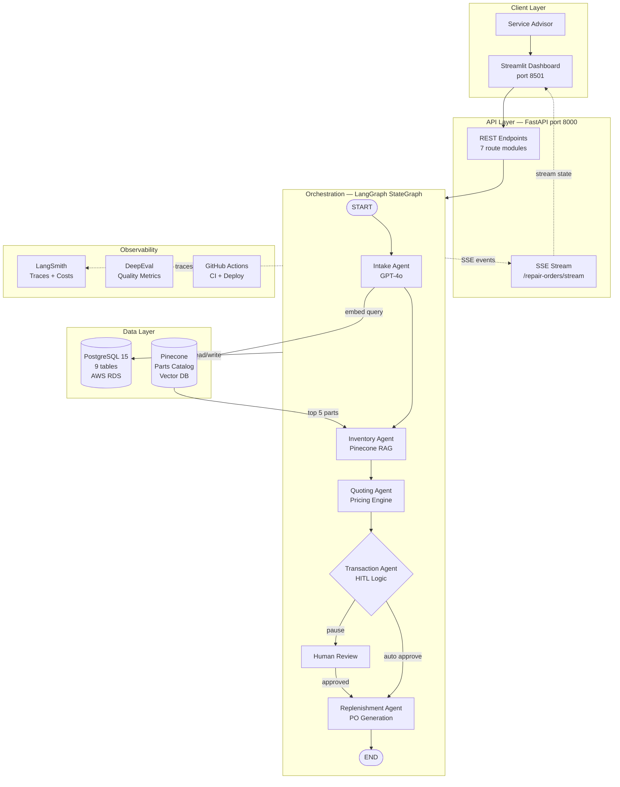
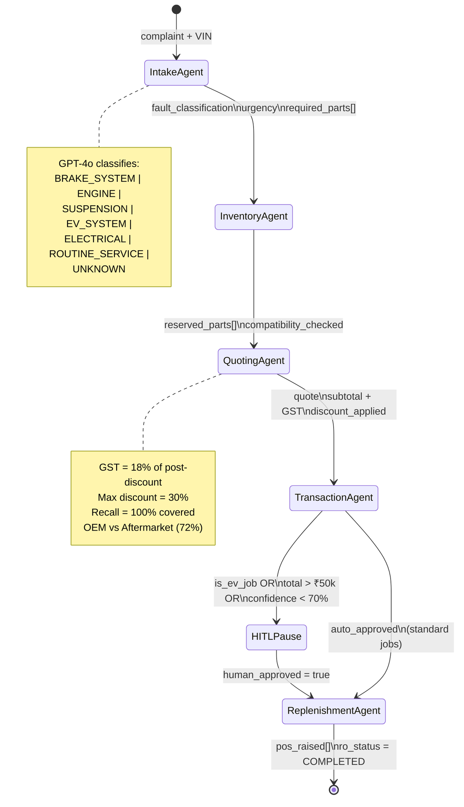
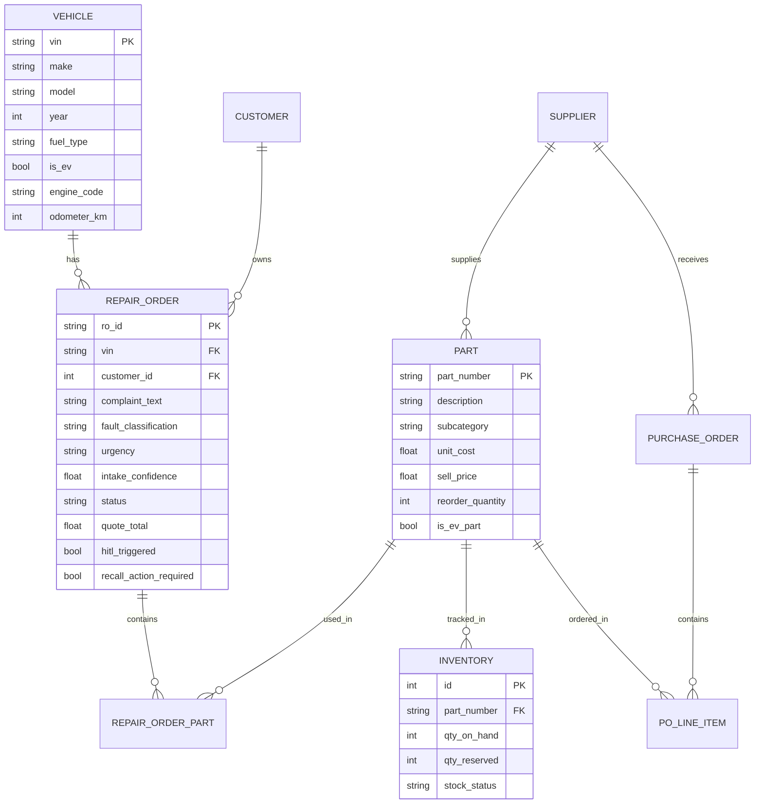
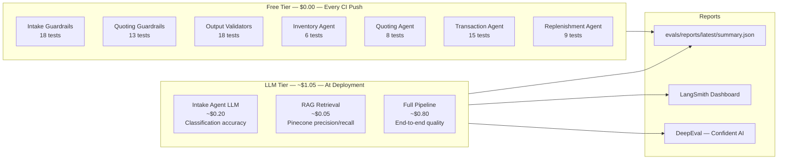
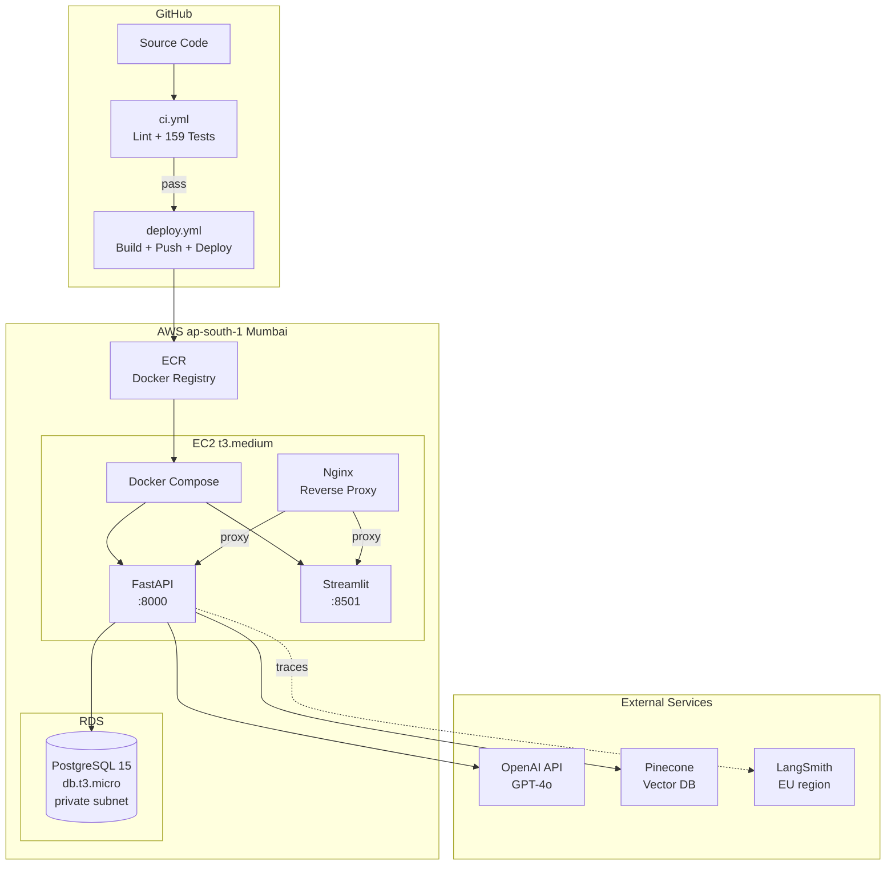

# CONDUIT — Architecture

## System Architecture

```mermaid
graph TB
    subgraph CLIENT["Client Layer"]
        SA[Service Advisor]
        DASH[Streamlit Dashboard<br/>port 8501]
    end

    subgraph API["API Layer — FastAPI port 8000"]
        EP[REST Endpoints<br/>7 route modules]
        SSE[SSE Stream<br/>/repair-orders/stream]
    end

    subgraph ORCH["Orchestration — LangGraph StateGraph"]
        direction LR
        S([START]) --> IA
        IA[Intake Agent<br/>GPT-4o] --> INV
        INV[Inventory Agent<br/>Pinecone RAG] --> QA
        QA[Quoting Agent<br/>Pricing Engine] --> TA
        TA{Transaction Agent<br/>HITL Logic}
        TA -->|auto approve| RA
        TA -->|pause| HITL[Human Review]
        HITL -->|approved| RA
        RA[Replenishment Agent<br/>PO Generation] --> E([END])
    end

    subgraph STORE["Data Layer"]
        PG[(PostgreSQL 15<br/>9 tables<br/>AWS RDS)]
        PC[(Pinecone<br/>Parts Catalog<br/>Vector DB)]
    end

    subgraph OBS["Observability"]
        LS[LangSmith<br/>Traces + Costs]
        DE[DeepEval<br/>Quality Metrics]
        GH[GitHub Actions<br/>CI + Deploy]
    end

    SA --> DASH
    DASH --> EP
    EP --> ORCH
    SSE -.->|stream state| DASH
    ORCH -.->|SSE events| SSE
    IA -->|embed query| PC
    PC -->|top 5 parts| INV
    ORCH -->|read/write| PG
    ORCH -.->|traces| LS
```

---

## Agent State Flow

```mermaid
stateDiagram-v2
    [*] --> IntakeAgent : complaint + VIN

    IntakeAgent --> InventoryAgent : fault_classification\nurgency\nrequired_parts[]

    InventoryAgent --> QuotingAgent : reserved_parts[]\ncompatibility_checked

    QuotingAgent --> TransactionAgent : quote\nsubtotal + GST\ndiscount_applied

    TransactionAgent --> HITLPause : is_ev_job OR\ntotal > ₹50k OR\nconfidence < 70%

    HITLPause --> ReplenishmentAgent : human_approved = true

    TransactionAgent --> ReplenishmentAgent : auto_approved\n(standard jobs)

    ReplenishmentAgent --> [*] : pos_raised[]\nro_status = COMPLETED

    note right of IntakeAgent
        GPT-4o classifies:
        BRAKE_SYSTEM | ENGINE |
        SUSPENSION | EV_SYSTEM |
        ELECTRICAL | ROUTINE_SERVICE |
        UNKNOWN
    end note

    note right of QuotingAgent
        GST = 18% of post-discount
        Max discount = 30%
        Recall = 100% covered
        OEM vs Aftermarket (72%)
    end note
```

---

## Data Model

```mermaid
erDiagram
    VEHICLE ||--o{ REPAIR_ORDER : has
    CUSTOMER ||--o{ REPAIR_ORDER : owns
    REPAIR_ORDER ||--o{ REPAIR_ORDER_PART : contains
    PART ||--o{ REPAIR_ORDER_PART : used_in
    PART ||--o{ INVENTORY : tracked_in
    SUPPLIER ||--o{ PART : supplies
    SUPPLIER ||--o{ PURCHASE_ORDER : receives
    PURCHASE_ORDER ||--o{ PO_LINE_ITEM : contains
    PART ||--o{ PO_LINE_ITEM : ordered_in

    VEHICLE {
        string vin PK
        string make
        string model
        int year
        string fuel_type
        bool is_ev
        string engine_code
        int odometer_km
    }

    REPAIR_ORDER {
        string ro_id PK
        string vin FK
        int customer_id FK
        string complaint_text
        string fault_classification
        string urgency
        float intake_confidence
        string status
        float quote_total
        bool hitl_triggered
        bool recall_action_required
    }

    PART {
        string part_number PK
        string description
        string subcategory
        float unit_cost
        float sell_price
        int reorder_quantity
        bool is_ev_part
    }

    INVENTORY {
        int id PK
        string part_number FK
        int qty_on_hand
        int qty_reserved
        string stock_status
    }
```

---

## Eval Architecture

```mermaid
graph LR
    subgraph FREE["Free Tier — $0.00 — Every CI Push"]
        G1[Intake Guardrails<br/>18 tests]
        G2[Quoting Guardrails<br/>13 tests]
        G3[Output Validators<br/>18 tests]
        C1[Inventory Agent<br/>6 tests]
        C2[Quoting Agent<br/>8 tests]
        C3[Transaction Agent<br/>15 tests]
        C4[Replenishment Agent<br/>9 tests]
    end

    subgraph PAID["LLM Tier — ~$1.05 — At Deployment"]
        L1[Intake Agent LLM<br/>~$0.20<br/>Classification accuracy]
        L2[RAG Retrieval<br/>~$0.05<br/>Pinecone precision/recall]
        L3[Full Pipeline<br/>~$0.80<br/>End-to-end quality]
    end

    subgraph REPORT["Reports"]
        R1[evals/reports/latest/summary.json]
        R2[LangSmith Dashboard]
        R3[DeepEval — Confident AI]
    end

    FREE --> R1
    PAID --> R1
    PAID --> R2
    PAID --> R3
```

---

## Deployment Architecture

```mermaid
graph TB
    subgraph GH["GitHub"]
        CODE[Source Code]
        CI[ci.yml<br/>Lint + 159 Tests]
        CD[deploy.yml<br/>Build + Push + Deploy]
    end

    subgraph AWS["AWS ap-south-1 Mumbai"]
        ECR[ECR<br/>Docker Registry]

        subgraph EC2["EC2 t3.medium"]
            DC[Docker Compose]
            API2[FastAPI<br/>:8000]
            DASH2[Streamlit<br/>:8501]
            NGX[Nginx<br/>Reverse Proxy]
        end

        subgraph RDS["RDS"]
            DB2[(PostgreSQL 15<br/>db.t3.micro<br/>private subnet)]
        end
    end

    subgraph EXT["External Services"]
        OAI[OpenAI API<br/>GPT-4o]
        PIN[Pinecone<br/>Vector DB]
        LSM[LangSmith<br/>EU region]
    end

    CODE --> CI
    CI -->|pass| CD
    CD --> ECR
    ECR --> DC
    DC --> API2
    DC --> DASH2
    NGX -->|proxy| API2
    NGX -->|proxy| DASH2
    API2 --> DB2
    API2 --> OAI
    API2 --> PIN
    API2 -.->|traces| LSM
```
